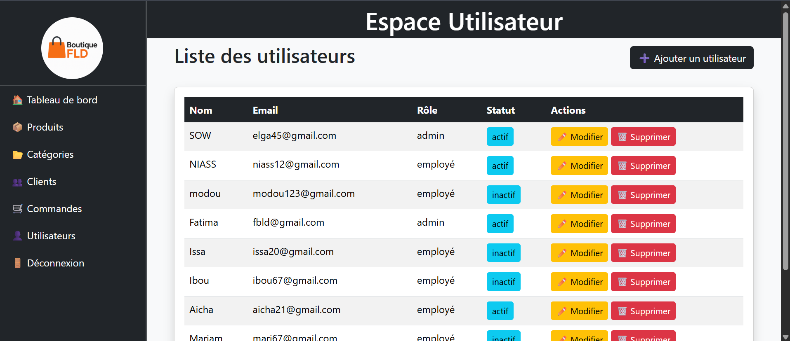

<!-- Social Preview -->
<meta property="og:image" content="https://github.com/your-username.png" />
<meta property="og:description" content="Description attrayante de votre projet" />
<meta property="og:image" content="https://github.com/votre-username/GestionStock_Boutique_FLD/raw/main/social-preview.png" />

# GestionStock_Boutique_FLD

## Description
Application web PHP simple permettant de gérer les produits, les catégories, les clients, et les commandes.<br> Utilise une architecture MVC (Models / Controllers / Views) pour une meilleure organisation du code.<br>

---<br>

## Structure du projet

GestionStock_Boutique_FLD/<br>
│<br>
├── config/<br>                      
│   ├── database.php          # Connexion PDO centralisée<br>
│   └── config.php            # Variables globales (URL, chemin base, constantes)<br>
│<br>
├── public/                   # Racine publique du projet (accessible depuis le navigateur)<br>
│   ├── dashboard.php         # Tableau de bord (page d’accueil après login)<br>
│   │<br>
│   ├── routes/               # Regroupe les points d’entrée de chaque module<br>
│   │   ├── auth.php          # Entrée Authentification (login, logout)<br>
│   │   ├── produit.php       # Entrée gestion produits<br>
│   │   ├── categorie.php     # Entrée gestion catégories<br>
│   │   ├── client.php        # Entrée gestion clients<br>
│   │   ├── commande.php      # Entrée gestion commandes<br>
│   │   └── utilisateur.php   # Entrée gestion utilisateurs<br>
│   │<br>
│   ├── uploads/              # Fichiers uploadés<br>
│   │   ├── produits/         # Images produits<br>
│   │   └── clients/          # Images clients (optionnel)<br>
│   │<br>
│   ├── css/<br>
│   │   ├── style.css         # Styles personnalisés<br>
│   │   └── bootstrap.min.css # Bootstrap local<br>
│   │<br>
│   ├── js/<br>
│   │   └── app.js            # Scripts personnalisés (validation formulaires, etc.)<br>
│   │<br>
│   └──images/<br>
│       └── logo.png          # Logo de la boutique<br>
│ <br>
│<br>
│<br>
├── src/<br>
│   ├── controllers/          # Contrôleurs : logique métier<br>
│   │   ├── AuthController.php<br>
│   │   ├── ProduitController.php<br>
│   │   ├── CategorieController.php<br>
│   │   ├── ClientController.php<br>
│   │   ├── CommandeController.php<br>
│   │   └── UtilisateurController.php<br>
│   │<br>
│   ├── models/               # Modèles : accès BDD via PDO<br>
│   │   ├── BaseModel.php<br>
│   │   ├── Utilisateur.php<br>
│   │   ├── Produit.php<br>
│   │   ├── Categorie.php<br>
│   │   ├── Client.php<br>
│   │   └── Commande.php<br>
│   │<br>
│   └── views/                # Vues (HTML/PHP)<br>
│       ├── templates/        # Templates communs<br>
│       │   ├── header.php<br>
│       │   ├── footer.php<br>
│       │   └── sidebar.php<br>
│       │<br>
│       ├── auth/             # Authentification<br>
│       │   ├── login.php<br>
│       │   └── logout.php<br>
│       │<br>
│       ├── produits/         # CRUD Produits<br>
│       │   ├── index.php<br>
│       │   ├── add.php<br>
│       │   ├── edit.php<br>
│       │   └── delete.php<br>
│       │<br>
│       ├── categories/       # CRUD Catégories<br>
│       │   ├── index.php<br>
│       │   ├── produitByCategorie.php<br>
│       │   ├── add.php<br>
│       │   ├── edit.php<br>
│       │   └── delete.php<br>
│       │<br>
│       ├── clients/          # CRUD Clients<br>
│       │   ├── index.php<br>
│       │   ├── CommandeByClient.php<br>
│       │   ├── add.php<br>
│       │   ├── edit.php<br>
│       │   └── delete.php<br>
│       │<br>
│       ├── commandes/        # CRUD Commandes + suivi état<br>
│       │   ├── index.php<br>
│       │   ├── add.php<br>
│       │   ├── edit.php<br>
│       │   ├── editEtat.php<br>
│       │   └── delete.php<br>
│       │<br>
│       └── utilisateurs/     # CRUD Utilisateurs<br>
│           ├── index.php<br>
│           ├── add.php<br>
│           ├── edit.php<br>
│           └── delete.php<br>
│<br>
├── sql/<br>
│   └── gestionstock.sql      # Script SQL complet<br>
│<br>
├── .htaccess                 # Redirections + sécurité<br>
├── README.md                 # Documentation du projet<br>
└── composer.json             # Autoload (si Composer utilisé)<br>


---

##  Installation

1. Clone le dépôt : <br>
   ```bash
   git clone https://github.com/ELGA45/GestionStock_Boutique_FLD.git
<br>
---<br>

##  Installation

1. Clone le dépôt :
   ```bash
   git clone https://github.com/ELGA45/GestionStock_Boutique_FLD.git 
   dossier dans ton serveur local (htdocs, www, etc.).
2. Exécute le script SQL dans sql/gestionstock.sql pour créer la base de données.<br>

3. Ouvre config/database.php et ajuste les identifiants (host, dbname, user, pass).<br>

4. Accède à http://localhost/GestionStock_Boutique_FLD/public/ pour commencer à utiliser l’application.<br>

## Fonctionnalités principales

Gestion des produits (CRUD : création, liste, modification, suppression) avec catégorie associée.<br>

Gestion des commandes : création (avec validation stock), consultation, mise à jour de l’état, suppression (avec restitution du stock si déjà livrée).<br>

Gestion des utilisateurs (admin/employé).<br>

## Note de développement

Chaque modèle hérite de BaseModel.php, qui gère la connexion à la base via PDO.<br>

Les controllers (ProduitController, CommandeController, ...) orchestrent les flux GET/POST, valident les données, appellent les modèles, puis chargent la vue correspondante.<br>

Les vues sont basées sur Bootstrap pour un rendu visuel propre et responsive.<br>

Les fichiers (formulaires) utilisent des validateurs simples côté PHP, et renvoient des messages clairs avec emojis (ex. : ✅, ⚠️, ❌).<br>

## Contribution

N’hésite pas à proposer des améliorations (meilleure gestion des sessions, role-based access control, validation JS, upload sécurisé, etc.).<br>   

## Interfaces

<br>
<br>
<br>
<br>
<br>
Page Utilisateur Admin<br>
<br>
Page Utilisateur Employé<br>
<br>